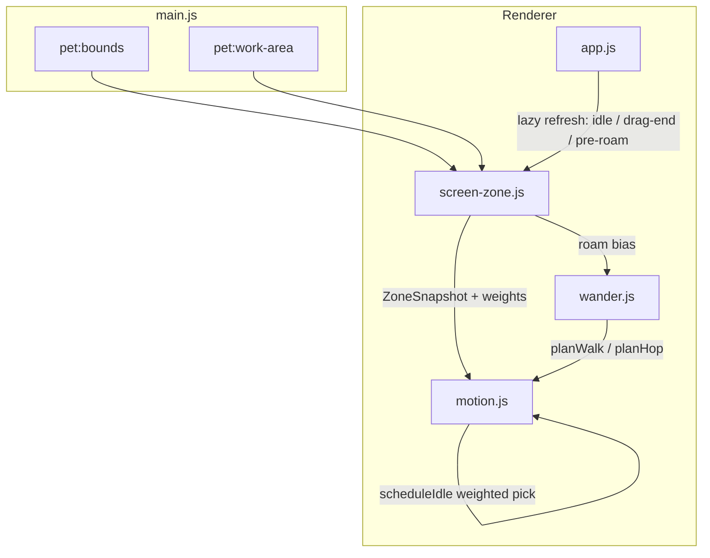
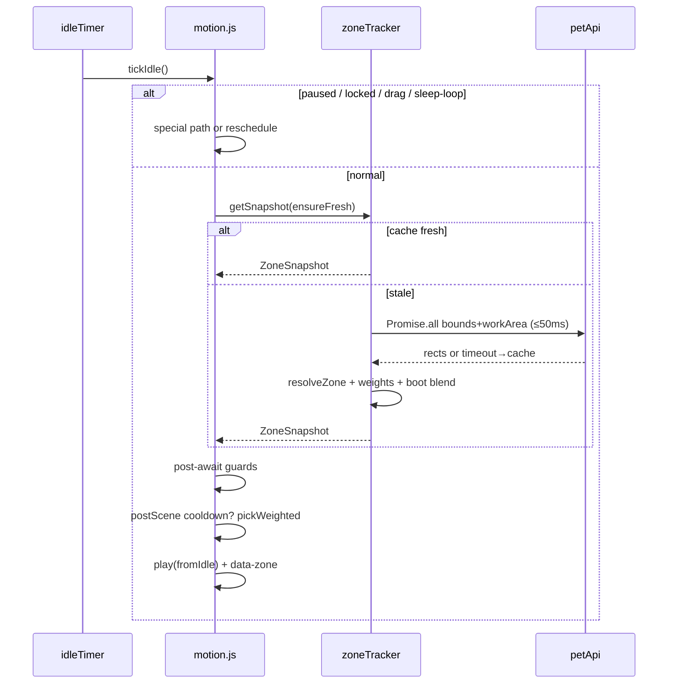
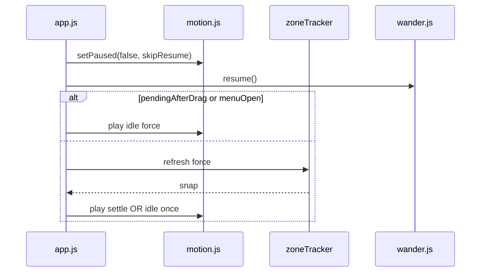

# Design: 屏幕分区姿势（Position-Aware Poses）

| Field | Value |
|-------|--------|
| **Title** | 屏幕分区姿势 / Position-Aware Poses for 天之川沙夜 |
| **Author** | — |
| **Date** | 2026-07-29 |
| **Status** | Draft（post-review rev.1.1 — product decisions locked） |
| **Scope** | Renderer motion / wander / app wiring; optional light main-process helpers only if needed |
| **Related code** | `src/character/motion.js`, `src/character/wander.js`, `src/app.js`, `preload.js`, `main.js` |

---

## Overview

今日沙夜的待机动作池（`IDLE_POOL`）与漫游决策对**窗口在桌面上的位置无感知**：无论贴边、角落还是开阔区，都同一套随机小动作。这会削弱「真实存在感」——贴着屏幕边缘的角色仍大幅伸懒腰、开阔区又与贴边行为无差别。

本设计引入轻量的 **屏幕分区（zone）+ 加权动作池 + 迟滞（hysteresis）与动作冷却**，让闲置与漫游在不同位置表现出不同的「环境意图」（贴边张望、角落安静坐、底部更易歇息、开阔区 freer 走动），同时**禁止硬切姿势**：不按像素边界瞬时换 pose，不与拖动 / 菜单 / talk·praise 场景抢播。

实现上新增独立模块 `src/character/screen-zone.js`（纯函数 + 懒采样 tracker），由 `motion.js` 的 idle 调度与 `wander.js` 的 roam 偏向消费；**优先复用现有帧包**，v1 不强制新美术。**v1 zone idle 池不含 `sleep`**（夜间仍走既有 `playScene` → `setContext("sleep")`）。

---

## Background & Motivation

### Current state（已核实）

| 组件 | 现状 | 文件 |
|------|------|------|
| 主进程位置 | `pet:move` / `pet:move-by`；`pet:bounds` / `pet:work-area`（`getDisplayMatching`） | `main.js` ~385–423、`preload.js` |
| 动作控制 | `createMotionController()` **无 deps**；`play` / `setFacing` / `lockFor` / idle 定时随机 `IDLE_POOL` | `src/character/motion.js` |
| Idle 池 | 固定：`sway, look, smile, nod, calm, soft, breathe, wave, stretch, sit`（**无 sleep**） | `motion.js` L54–65 |
| 场景动作 | `SCENE_ACTION`；`playScene` → night 时 `setContext("sleep")` | `motion.js` L67–80, L478–482 |
| 定时回落 | hold 结束：`ctx === "sleep" ? "sleep" : "idle"` | `motion.js` L380–382 |
| 漫游 | 水平 edge-aware；`tryRoam` 仅 calm 列表；`EDGE_MARGIN_PX=18`；`ROAM_CHANCE=0.62`；`WALK_VS_HOP=0.82` | `src/character/wander.js` |
| 默认落点 | 右下 inset **24px** → 几何上稳定 `corner-br` | `main.js` L136–141 |
| 帧资源 | `assets/animations/<action>/` + `anim-manifest.js` | look/sit/sleep/alert/… 均已存在 |
| 测试 | **无 test runner**（`package.json` 仅 `start`/`dev`） | 验收以手动矩阵为准 |

### Pain points

1. **无场所感**：贴右下角与屏幕中央行为相同。
2. **机械感风险**：硬 FSM 贴边立刻 lean 会在拖过边界时抖 pose。
3. **优先级冲突**：拖动 `setPaused(true)` → `drag`；菜单 walk/sit；`say()` → `playScene`。分区只改 **idle / auto-roam**。
4. **性能预算**：禁止每帧 IPC；默认 **懒采样**（见 Key Decision #11），非 2 Hz 轮询。

### Character tone

沙夜：安静、内敛、星夜气质。贴边偏「小心张望 / 倚靠安静」，开阔区才略活泼。默认右下角需 **防过静**（见 Key Decision #12）。

---

## Goals & Non-Goals

### Goals

1. 根据窗口 **AABB 相对 workArea 的外侧剩余 space**，得到稳定 **zone id**（含迟滞）。
2. Idle 随机动作改为 **按 zone 加权采样**（同一套 `play()` 管线）。
3. 漫游频率 / walk·hop 比例 / 方向偏好随 zone 微调。
4. 拖动结束后：与 `setPaused` **协调的单次** settle 或 idle（无双 force-play）。
5. 过渡自然：hysteresis、`MIN_ZONE_DWELL`、动作冷却；不打断 locked / paused / 场景动作。
6. 可观测：`data-zone`（始终写 last-known）、debug flag、PR1 手动矩阵。
7. 增量可合并：分 PR；v1 零新帧包；**PR2 即含 sleep 日间门禁与默认角权重策略**。

### Non-Goals

- 真实物理 / 多窗吸附。
- **垂直 hop / 纵向 locomotion**（v1 **与近期路线图均不做**；`edge-top` / `corner-t*` 仅影响 idle 权重与水平 roam bias，见 Key Decision #20）。
- v1 必选新美术（`peek` / `lean` → 可选 PR6）。
- 亲密度、托盘；**设置页 UI**（v1 仅 `localStorage` 旗标，见 Key Decision #8）。
- 全面重写 `dialogue.js` 场景库（仅区分 menu sit vs zone sit 文案通道，见 Key Decision #19）。
- Zone 持久化；主进程 zone 权威分类（v1 否决，见 Alternatives E）。
- `ZONE_CHANGE_COOLDOWN_MS` 意图类冷却（v1 **不做**，见 Key Decision #13）。
- 「先看再走」延迟漫游序列（v1 **不做**）。

---

## Proposed Design

### High-level architecture



### Module: `src/character/screen-zone.js`（新建）

职责：

1. 从 `bounds` + `workArea` 计算 **外侧剩余 space**（唯一规范几何输入）。
2. `classifyRaw` / `stillInZone` / `resolveZone`（完整迟滞，见下）。
3. 导出 `zoneIdleWeights`、`zoneRoamBias`、`pickWeightedAction`。
4. `createZoneTracker`：**懒采样** + 缓存 + IPC 超时回退。

#### Normative geometry（外侧剩余 space only）

**不**用脚心 `(ax,ay)` 做 zone 分类。`main.js` `setMode` 锚点是底中 **−20px**（`anchorY = y + height - 20`），与 zone 无关；zone 只关心窗口矩形相对 workArea 的空隙，与 `wander.js` `leftRoom`/`rightRoom` 同构。

```js
/**
 * @param {{ x:number,y:number,width:number,height:number }} bounds
 * @param {{ x:number,y:number,width:number,height:number }} workArea
 * @returns {{ left:number, right:number, above:number, below:number }}
 */
export function computeSpaces(bounds, workArea) {
  // Clamp ≥0: multi-monitor / partial off-workArea can yield negatives before clamp
  const left = Math.max(0, bounds.x - workArea.x);
  const right = Math.max(0, workArea.x + workArea.width - (bounds.x + bounds.width));
  const above = Math.max(0, bounds.y - workArea.y);
  const below = Math.max(0, workArea.y + workArea.height - (bounds.y + bounds.height));
  return { left, right, above, below };
}
```

**与 wander `EDGE_MARGIN_PX=18` 的关系**：zone 阈值（72/110）描述「场所带」，wander margin 描述「别贴死再踏步」。**zone 不减 18**——否则默认 24px inset 会几乎总是 open/edge 混淆。两套数字分层，文档固定即可。

可选 debug：`nx/ny` 可从脚心算出写入 snapshot，**不参与** classify。

默认落点：`spaceRight=24`, `spaceBelow=24` → raw `corner-br`。

#### Zone taxonomy

```text
                    space.above small
                          │
          ┌───────────────┼───────────────┐
          │ corner-tl   edge-top  corner-tr │
 space    │                                 │  space
 .left    │ edge-left    open   edge-right  │  .right
 small    │                                 │  small
          │ corner-bl  edge-bottom corner-br│
          └───────────────┼───────────────┘
                    space.below small
```

| ZoneId | 角色意图 |
|--------|----------|
| `open` | 自由 idle、walk、stretch、hop |
| `edge-left` / `edge-right` | 面外侧、look / alert 略高 |
| `edge-top` | look / soft；少 hop |
| `edge-bottom` | sit / calm 略高（无 sleep 入池） |
| `corner-bl` / `corner-br` | 安静 rest（**权重已做默认落点防过静**） |
| `corner-tl` / `corner-tr` | soft / look / alert |

---

### Hysteresis — closed algorithm（implement exactly）

#### Config defaults

```js
export const ZONE_CONFIG = {
  ENTER_EDGE_PX: 72,
  EXIT_EDGE_PX: 110,
  MIN_ZONE_DWELL_MS: 2500,
  /** Max age of cached snapshot before idle/roam must refresh */
  SNAPSHOT_FRESH_MS: 1000,
  /** Dual-IPC timeout; on timeout use last cache or null */
  IPC_TIMEOUT_MS: 50,
  /** After process start: blend open∩zone weights (see #12) */
  BOOT_ZONE_GRACE_MS: 8 * 60 * 1000,
  BOOT_OPEN_BLEND: 0.45, // 45% open table + 55% zone table during grace
  /** Corner walk duration scale applied BEFORE resolveWalkPlan */
  WALK_MS_CORNER_SCALE: 0.8,
  /** Post-scene idle picks suppressed this long after playScene hold ends */
  POST_SCENE_IDLE_COOLDOWN_MS: 3500,
};
// NOTE: ZONE_CHANGE_COOLDOWN_MS intentionally absent in v1 (Key Decision #13)
```

#### Axis flags

```js
function axisFlags(spaces, thr) {
  return {
    L: spaces.left <= thr,
    R: spaces.right <= thr,
    T: spaces.above <= thr,
    B: spaces.below <= thr,
  };
}
```

#### 1. `classifyRaw(spaces)` — ENTER only

Priority: **corner > edge > open**. Horizontal + vertical both ENTER → corner. Both L and R ENTER → nearer side (`spaces.left <= spaces.right` → left). Both T and B ENTER → nearer vertical. All four small（极窄 workArea）：先定水平 nearer，再定垂直 nearer → 唯一 corner。

```js
/** @returns {ZoneId} */
export function classifyRaw(spaces, enterPx = ZONE_CONFIG.ENTER_EDGE_PX) {
  const f = axisFlags(spaces, enterPx);
  const h = f.L || f.R; // horizontal edge interest
  const v = f.T || f.B;

  // Horizontal side when both L&R: nearer (smaller space wins)
  const hSide = f.L && f.R
    ? (spaces.left <= spaces.right ? "left" : "right")
    : f.L ? "left" : f.R ? "right" : null;
  const vSide = f.T && f.B
    ? (spaces.above <= spaces.below ? "top" : "bottom")
    : f.T ? "top" : f.B ? "bottom" : null;

  if (hSide && vSide) {
    const map = {
      "left|top": "corner-tl",
      "right|top": "corner-tr",
      "left|bottom": "corner-bl",
      "right|bottom": "corner-br",
    };
    return map[`${hSide}|${vSide}`];
  }
  if (hSide) return hSide === "left" ? "edge-left" : "edge-right";
  if (vSide) return vSide === "top" ? "edge-top" : "edge-bottom";
  return "open";
}
```

#### 2. `stillInZone(prevZone, spaces)` — EXIT thresholds

Rule: **stay in `prevZone` while that zone’s defining axes still satisfy EXIT band, AND we have not entered a *different corner* under ENTER.**

Defining axes:

| prevZone | Stay while… |
|----------|-------------|
| `open` | always `false` for stay-by-exit (open has no exit band; leave only via raw≠open after dwell) — implement as: `stillInZone("open")` → `false` always, so open→edge uses only dwell |
| `edge-left` | `spaces.left ≤ EXIT_EDGE_PX` **and** not (`spaces.left≤ENTER && (above\|below)≤ENTER` forming a **different** raw corner that isn’t left-based wait): specifically: if `classifyRaw(ENTER)` is a corner that is **not** `corner-tl`/`corner-bl`, do not stay; if raw is `corner-tl`/`corner-bl`, **do not stay as edge** — promote to that corner on next resolve (see below) |
| `edge-right` | symmetric on `right` |
| `edge-top` | `spaces.above ≤ EXIT` |
| `edge-bottom` | `spaces.below ≤ EXIT` |
| `corner-br` | `spaces.right ≤ EXIT` **AND** `spaces.below ≤ EXIT`（**单边出带即离开 corner**，唯一规则；无「两边均>90」并列） |
| `corner-bl` | `left ≤ EXIT` AND `below ≤ EXIT` |
| `corner-tr` | `right ≤ EXIT` AND `above ≤ EXIT` |
| `corner-tl` | `left ≤ EXIT` AND `above ≤ EXIT` |

**Corner → edge 过渡（规范）**：当 `stillInZone(corner-*)` 为 false 时，用 `classifyRaw(ENTER)` 得到新 raw（可能是 `edge-bottom` 若仅 right 已 >72 但 below 仍 ≤72）。**不**在 exit 带内强行保持 corner。

**Edge → corner 过渡**：若 `prev` 是 `edge-bottom` 且 `stillInZone` true，但 `classifyRaw` 已是 `corner-br`：

- **规范**：若 raw 是 **更强** 的 corner（corner ⊃ edge），**立即接受 raw**（跳过 exit-stay），仍受 `MIN_ZONE_DWELL` 约束 unless `force`。  
  即：`stillInZone` 仅阻止「退出当前区到更松区」；**向内收紧（open→edge→corner）在 dwell 允许后立即生效**。

```js
const RANK = { open: 0, edge: 1, corner: 2 };
function rank(z) {
  if (z.startsWith("corner")) return 2;
  if (z.startsWith("edge")) return 1;
  return 0;
}

export function stillInZone(prevZone, spaces, exitPx = ZONE_CONFIG.EXIT_EDGE_PX) {
  if (!prevZone || prevZone === "open") return false;
  const s = spaces;
  switch (prevZone) {
    case "edge-left":
      return s.left <= exitPx;
    case "edge-right":
      return s.right <= exitPx;
    case "edge-top":
      return s.above <= exitPx;
    case "edge-bottom":
      return s.below <= exitPx;
    case "corner-bl":
      return s.left <= exitPx && s.below <= exitPx;
    case "corner-br":
      return s.right <= exitPx && s.below <= exitPx;
    case "corner-tl":
      return s.left <= exitPx && s.above <= exitPx;
    case "corner-tr":
      return s.right <= exitPx && s.above <= exitPx;
    default:
      return false;
  }
}

/**
 * @param {{ force?: boolean, enteredAt?: number }} meta
 * @returns {ZoneId}
 */
export function resolveZone(spaces, prevZone, now, meta = {}) {
  const raw = classifyRaw(spaces);
  if (!prevZone) return raw;
  if (meta.force) return raw;

  const dwellOk =
    meta.enteredAt == null ||
    now - meta.enteredAt >= ZONE_CONFIG.MIN_ZONE_DWELL_MS;

  // Inward promotion: open→edge→corner allowed when dwell elapsed
  if (rank(raw) > rank(prevZone)) {
    return dwellOk ? raw : prevZone;
  }

  // Same zone
  if (raw === prevZone) return prevZone;

  // Outward or lateral: hold while still in exit band
  if (stillInZone(prevZone, spaces)) {
    return prevZone;
  }

  // Exit band cleared — switch only if dwell ok
  return dwellOk ? raw : prevZone;
}
```

**`force: true`**（拖动结束 refresh）：忽略 dwell 与 exit-stay，直接 `classifyRaw`。

**Tracker 状态**：`{ zoneId, enteredAt, spaces, sampledAt, idleWeights, roam, facingHint }`。

---

### Soft intent（非硬状态机）

Zone 映射为且仅为：

1. **Idle 权重向量** `Record<ActionId, number>`
2. **Roam** `{ roamChanceMul, walkVsHop, preferDir }`（**无** `sitBias` / `sleepBias` / `preferOutward` 死字段）
3. **Facing hint**（仅 lookish idle）

#### Normative idle-eligible set

```js
/** Zone-weighted pool membership (v1). sleep excluded — Key Decision #14 */
export const ZONE_IDLE_ACTIONS = [
  "breathe", "sway", "look", "smile", "nod", "calm", "soft",
  "wave", "stretch", "sit", "alert", "coat",
];
// Never in zone idle pool: walk, hop, talk, shy, celebrate, bounce, drag, sleep, idle (idle is fallback only)
```

- Flag **off** / null snapshot：沿用今日 `IDLE_POOL`（无 `alert`/`coat`）— 行为与现网一致。
- Flag **on**：上表；`alert`/`coat` 仅在 zone 路径出现。

#### `pickWeightedAction` — lives in `screen-zone.js` only

```js
/**
 * @param {Record<string, number>} weights
 * @param {Map<string, number>|Record<string, number>} cooldowns  actionId → readyAt ms
 * @param {number} now
 * @param {Record<string, ActionDef>} actionCatalog  typically ACTIONS from motion
 * @returns {string} action id
 */
export function pickWeightedAction(weights, cooldowns, now, actionCatalog) {
  const getCd = (id) =>
    cooldowns instanceof Map ? cooldowns.get(id) || 0 : cooldowns[id] || 0;

  const entries = Object.entries(weights)
    .filter(([id, w]) => w > 0 && Boolean(actionCatalog[id]))
    .map(([id, w]) => {
      const readyAt = getCd(id);
      const factor = now < readyAt ? 0.15 : 1; // decay, not hard ban
      return [id, w * factor];
    });

  const sum = entries.reduce((s, [, w]) => s + w, 0);
  if (sum <= 0 || entries.length === 0) {
    // All missing / zero weight / broken table
    return "idle";
  }
  let r = Math.random() * sum;
  for (const [id, w] of entries) {
    r -= w;
    if (r <= 0) return id;
  }
  return entries[entries.length - 1][0];
}
```

#### Scalar cooldown defaults（`markCooldown` 写入 `now + ms`）

| Action | cooldown ms |
|--------|-------------|
| `sit` | **30000** |
| `stretch` | **18000** |
| `wave` | **18000** |
| `coat` | **20000** |
| `look` | **8000** |
| `alert` | **8000** |
| `smile` / `nod` / `soft` / `calm` / `sway` / `breathe` | **5000** |

---

### Zone → Idle 权重表（v1）

**无 `sleep` 行。** 夜间睡觉仍只走 `playScene` / 既有 sleep 分支。

| Action | open | edge-L/R | edge-bottom | edge-top | corner-b* | corner-t* |
|--------|------|----------|-------------|----------|-----------|-----------|
| `breathe` | 1.2 | 1.0 | 1.4 | 1.0 | 1.3 | 1.0 |
| `sway` | 1.2 | 0.7 | 0.6 | 0.8 | 0.5 | 0.5 |
| `look` | 1.0 | **2.2** | 0.9 | **2.0** | 1.2 | **2.4** |
| `smile` | 1.0 | 0.6 | 0.7 | 0.8 | 0.5 | 0.6 |
| `nod` | 0.8 | 0.5 | 0.6 | 0.5 | 0.4 | 0.4 |
| `calm` | 1.0 | 1.2 | **1.6** | 1.1 | **1.6** | 1.2 |
| `soft` | 1.0 | 1.0 | 1.2 | **1.6** | 1.3 | **1.8** |
| `wave` | 0.7 | 0.3 | 0.3 | 0.4 | 0.2 | 0.3 |
| `stretch` | **1.4** | 0.5 | 0.4 | 0.6 | 0.3 | 0.3 |
| `sit` | 0.6 | 0.9 | **1.6** | 0.3 | **1.4** | 0.4 |
| `alert` | 0.3 | **1.4** | 0.5 | 1.0 | 0.7 | **1.6** |
| `coat` | 0.4 | 0.5 | 0.6 | 0.5 | 0.6 | 0.5 |

**Default corner-br 防过静（PR2 必做，非 PR4）**：

1. 上表 corner-b* `sit` 已封顶 **1.4**（非 2.4）；`roamChanceMul` 见下表 **0.55**。
2. **`BOOT_ZONE_GRACE_MS`（8 min）**：`zoneIdleWeights` 返回  
   `w(a) = BOOT_OPEN_BLEND * open[a] + (1 - BOOT_OPEN_BLEND) * zone[a]`。  
   Tracker 在 `start()` 记 `bootAt`；grace 结束后用纯 zone 表。
3. **不**改 `defaultPosition` 24px inset（产品落点不变）。

```js
export function zoneIdleWeights(zoneId, ctx = {}) {
  const table = WEIGHTS[zoneId] || WEIGHTS.open;
  const bootAt = ctx.bootAt ?? 0;
  const now = ctx.now ?? Date.now();
  let w = { ...table };
  if (bootAt && now - bootAt < ZONE_CONFIG.BOOT_ZONE_GRACE_MS) {
    const open = WEIGHTS.open;
    const b = ZONE_CONFIG.BOOT_OPEN_BLEND;
    w = Object.fromEntries(
      ZONE_IDLE_ACTIONS.map((id) => [
        id,
        b * (open[id] || 0) + (1 - b) * (table[id] || 0),
      ]),
    );
  }
  return w;
}
```

`currentAction === "sleep"` 时 `tickIdle` **仍走现有 35% breathe / 65% sleep**，不因 zone 改权重、**不**用 zone 池替换 sleep 循环。

---

### Zone → Roam 偏向

| Zone | `roamChanceMul` | `walkVsHop` | `preferDir` | 备注 |
|------|-----------------|-------------|-------------|------|
| `open` | 1.15 | 0.75 | `null`（用 facing） | freer |
| `edge-left` | 0.90 | 0.90 | `+1`（向右离开） | |
| `edge-right` | 0.90 | 0.90 | `-1` | 默认落点常见 |
| `edge-bottom` | 0.75 | 0.95 | `null` | 少 hop |
| `edge-top` | 0.60 | 0.95 | `null` | v1 仅水平 |
| `corner-b*` | **0.55** | 0.98 | 离开角：bl→`+1`，br→`-1` | 安静但不锁死 |
| `corner-t*` | 0.50 | 0.95 | tl→`+1`，tr→`-1` | |

#### Calm list expansion（Key Decision #15）

今日 `tryRoam` calm：`idle, breathe, sway, look, calm, soft, smile`。

**v1 扩展** `isCalmAction`：

```js
const CALM_FOR_ROAM = new Set([
  "idle", "breathe", "sway", "look", "calm", "soft", "smile",
  "alert", "nod", // zone-favored micros that must not hard-block roam
]);
// Still block: sit, sleep, stretch, coat, wave, talk, walk, hop, drag, …
```

**意图**：zone 提高 `look`/`alert` 时不应与 `roamChanceMul` **双重**闷死走动。  
**`sit` / `sleep` 仍阻断 auto-roam**——坐下后安静是角色正确；额外 dampening 视为 **intentional**（坐着就少走）。

`stretch`/`coat`/`wave` 保持非 calm：open 区 stretch 多时短暂少 roam 可接受（clip 短）。

#### Walk plan constants

```js
// In planWalk, after choosing base duration:
if (zoneId?.startsWith("corner")) {
  duration *= ZONE_CONFIG.WALK_MS_CORNER_SCALE; // 0.8 BEFORE resolveWalkPlan
}
const preferredDir = opts.preferDir ?? facingDir;
const plan = await resolveWalkPlan(preferredDir, duration);
// resolveWalkPlan room<40 flip 逻辑不变 — 安全优先于 zone preferDir
```

- **Hop**：v1 **仍仅 facing**，无 edge preferDir / room 翻转（non-goal）。
- **「先看再走」**：明确 **defer**，不实现延迟序列。

---

### Facing soft rules（idle only）

Lookish = `{ look, alert, soft }`。

- `edge-left` / `corner-*-l` → `setFacing("left")`
- `edge-right` / `corner-*-r` → `setFacing("right")`
- `open`：保持；20% 随机翻面（可选）
- **禁止**在 walk/hop 中改 facing

---

### Preemption matrix（normative）

| Source ↓ \ Active → | drag / paused | `lockedUntil` | playScene hold | menu force play | sleep action/context | bubble only |
|---------------------|---------------|---------------|----------------|-----------------|----------------------|-------------|
| **Zone idle `tickIdle`** | deny（reschedule） | deny | deny | deny | special：仅 breathe/sleep 环，不用 zone 池 | allow weighted |
| **Zone settle** | deny | deny if locked | deny | deny | deny（不打断 sleep） | allow if no pending scene |
| **Roam bias / planWalk auto** | deny hard | N/A（plan 前再检） | deny via non-calm | force menu walk 不受 bias 限制 | deny soft auto | allow if calm |
| **Menu walk/sit** | deny if hard blocked | menu may lockFor | overwrites | — | menu walk clears context | — |

规则细则：

1. **Zone 永不写 `lockedUntil` 更小值**；不 `clear` lock。
2. **`playScene` 结束后**：记 `postSceneUntil = now + POST_SCENE_IDLE_COOLDOWN_MS`；`tickIdle` 在此窗口内 **强制** `pick = "breathe"` 或 `"calm"`（等权），避免 talk 后立刻 corner sit。
3. **菜单 sit**（`app.js` 现状）：`lockFor(6000)` → `say("talk")`（`playScene` talk）→ `play("sit", force)`。Zone **不得**「修正」此顺序；sit force 盖 talk 是 **既有 quirk**，本功能不改。菜单坐下 **文案**与 zone 自动坐下区分，见下节与 Key Decision #19。
4. **`fromIdle` + paused**：保持 `play` 现有 no-op；zone tick 必须先查 `paused`。
5. **Async 后置守卫**：`tickIdle` / `tryRoam` 在 **await snapshot/bias 之后** 必须重检 `enabled` / `paused` / `lockedUntil` / `isHardBlocked` / `currentAction`（非 drag）。

---

### Dialogue: menu sit vs zone auto-sit（产品已决）

菜单「坐下」与 zone 加权池 / settle 触发的 `sit` **语气必须区分**（Key Decision #19）。

| 来源 | 语气 | 文案策略 | 气泡 |
|------|------|----------|------|
| **菜单 sit** | 主动休息、用户点名 | 保持现有 deliberate rest 风格，如「稍微坐下来休息一会儿吧。」（`app.js` `handleMenuAction("sit")`） | **始终**（与今日一致） |
| **Zone idle / settle sit** | 安静、场所感、不打扰 | 可选 place-aware 轻声线（角落轻靠、贴边歇一下）；**默认多数无气泡** | 若出线，概率 **&lt;15%**，避免贴边休息时唠叨 |

实现提示（不挡 PR2 动作接线）：

- 在 `dialogue.js`（或等价）增加 `zoneSit` / place-aware pick：可按 `zoneId` 选 corner vs edge 轻声线；语气弱于菜单 rest。
- **菜单路径**继续用主动 rest 固定/场景线，**不要**走 `zoneSit` 池。
- Zone `play("sit", { fromIdle: true })`：默认只播动画；仅当抽中 &lt;15% 且 UI 允许气泡时再 `openBubble` + `zoneSit` 文案。
- 接线可放在 **PR4**（与 settle / 气泡体验一起）或 PR2 末尾小补丁；**PR2 至少**在 `tickIdle` 注释/回调钩子上标明「zone sit ≠ menu sit 文案」。

示例语气（实现时可改写，仅定调）：

- 菜单：`稍微坐下来休息一会儿吧。`
- Zone corner（罕见气泡）：`……就在这边靠一会儿。`
- Zone edge-bottom（罕见气泡）：`脚边安静一点，也好。`

---

### Integration points

#### 1. `motion.js`

```js
export function createMotionController(deps = {}) {
  const getZoneSnapshot = deps.getZoneSnapshot || null;
  // actionCooldowns: Map
  // postSceneUntil: number
  // …
}

function setPaused(value, opts = {}) {
  const next = Boolean(value);
  if (next === paused) return;
  paused = next;
  if (paused) {
    savedBeforePause = currentAction === "drag" ? savedBeforePause : currentAction;
    clearIdleTimer();
    play("drag", { force: true });
  } else {
    // Key Decision #16: skipResume for coordinated drag-end
    if (opts.skipResume) {
      // leave paused=false; do NOT play; caller owns next play
      // still clear drag art only if still on drag:
      if (currentAction === "drag" && opts.resumeAction !== undefined) {
        // no-op here; caller plays
      }
      scheduleIdle(); // only if caller will not play — prefer caller clears
      return;
    }
    const resume = savedBeforePause === "drag" ? "idle" : savedBeforePause || "idle";
    play(opts.resumeAction ?? resume, { force: true, fromIdle: true });
    scheduleIdle();
  }
}
```

**`tickIdle`（完整）**：

```js
async function tickIdle() {
  if (!enabled || paused || Date.now() < lockedUntil) {
    scheduleIdle();
    return;
  }
  if (currentAction === "sleep") {
    play(Math.random() < 0.35 ? "breathe" : "sleep", { fromIdle: true });
    return;
  }
  if (currentAction === "drag") {
    scheduleIdle();
    return;
  }

  let pick = null;
  let zoneIdForDom = null;
  try {
    let snap = getZoneSnapshot ? await Promise.resolve(getZoneSnapshot({ ensureFresh: true })) : null;
    // POST-AWAIT GUARDS
    if (!enabled || paused || Date.now() < lockedUntil) {
      scheduleIdle();
      return;
    }
    if (currentAction === "sleep" || currentAction === "drag") {
      scheduleIdle();
      return;
    }

    if (Date.now() < postSceneUntil) {
      pick = Math.random() < 0.5 ? "breathe" : "calm";
    } else if (snap?.idleWeights) {
      zoneIdForDom = snap.zoneId;
      pick = pickWeightedAction(snap.idleWeights, actionCooldowns, Date.now(), ACTIONS);
      if (snap.facingHint && LOOKISH.has(pick)) setFacing(snap.facingHint);
    }
  } catch {
    pick = null;
  }

  if (!pick || pick === "idle" && !ACTIONS[pick]?.frames) {
    pick = IDLE_POOL[Math.floor(Math.random() * IDLE_POOL.length)];
  }
  // Always stamp last-known zone if tracker has one
  const z = zoneIdForDom ?? deps.getLastZoneId?.();
  if (actor && z) actor.dataset.zone = z;

  markCooldown(pick);
  play(pick, { fromIdle: true });
}
```

`playScene`：在成功 `play` 后设 `postSceneUntil`（基于 hold 时长：在 action timer 回调里设，或 `playScene` 时 `postSceneUntil = now + hold + POST_SCENE…`）。

#### 2. `wander.js`

- `getRoamBias` optional；`isCalmAction` 扩展见上。
- `tryRoam`：**await bias 前** 可 stale；**规范**在 `tryRoam`/`planWalk` 入口 `await getRoamBias({ ensureFresh: true })`，await 后 `canAutoRoam` / `isHardBlocked` 再检。
- `planWalk({ force, preferDir })`；corner scale **0.8 before** `resolveWalkPlan`。

#### 3. `app.js` — tracker + drag-end（无双播）

```js
const zoneTracker = createZoneTracker({
  getBounds: () => window.petApi?.bounds?.() ?? Promise.resolve(null),
  getWorkArea: () => window.petApi?.workArea?.() ?? Promise.resolve(null),
  // NO continuous intervalMs polling by default
  enabled: () => localStorage.getItem("saya.zonePoses") !== "0",
});

const motion = createMotionController({
  getZoneSnapshot: (opts) => zoneTracker.getSnapshot(opts),
  getLastZoneId: () => zoneTracker.getZoneId(),
});

const wander = createWanderController({
  // existing…
  getRoamBias: (opts) => zoneTracker.getRoamBias(opts),
});
```

**Lazy sampling contract**（Key Decision #11）：

| Trigger | Behavior |
|---------|----------|
| `getSnapshot({ ensureFresh })` 且 cache age ≤ `SNAPSHOT_FRESH_MS` | 同步返回 cache |
| ensureFresh 且 stale / miss | `Promise.all([bounds, workArea])` + `IPC_TIMEOUT_MS` race；超时用 cache 或 null |
| 拖动结束 | `refresh({ force: true })` — 忽略 dwell/exit |
| `tryRoam` / `planWalk` 前 | ensureFresh |
| 可选 heartbeat | **仅**若需 CSS `data-zone` 实时：`≥ 3000ms`；v1 **默认关闭** |

```js
// finishPointer when dragged:
async function finishDragWithZone() {
  // 1) Unpause WITHOUT resuming pre-drag clip
  motion.setPaused(false, { skipResume: true });
  wander.resume();

  // 2) If deferred UI pending (pendingAfterDrag), do NOT settle — let rAF deferred run
  if (pendingAfterDrag) {
    motion.play("idle", { force: true, fromIdle: true });
    return;
  }
  if (menuOpen) {
    motion.play("idle", { force: true, fromIdle: true });
    return;
  }

  const snap = await zoneTracker.refresh({ force: true });
  // post-await: if user already pointerdown again, abort
  if (isDragging || pointerArmed || motion.isPaused?.()) return;

  // 3) Single play path
  if (snap && Math.random() < 0.45) {
    const z = snap.zoneId;
    if ((z.startsWith("corner-b") || z === "edge-bottom") && Math.random() < 0.35) {
      motion.play("sit", { force: true, holdMs: 3500 });
      return;
    }
    if (z.startsWith("edge") || z.startsWith("corner")) {
      if (snap.facingHint) motion.setFacing(snap.facingHint);
      motion.play(Math.random() < 0.5 ? "look" : "soft", { force: true });
      return;
    }
  }
  motion.play("idle", { force: true, fromIdle: true });
}
```

**非拖动 pointerup**（点击）：保持现有 `setPaused(false)` 默认 resume 路径（通常未 paused）。

#### 4. Main / preload

v1 不改。可选 PR5：`pet:placement`。

#### 5. CSS（PR4 only，optional）

`.pet-shadow` **已有** `transform: translateX(-50%)` 与 act 覆盖（`act-sit` scaleX 1.15 等）。若加 zone 规则，必须 **合并** translateX：

```css
.pet-actor[data-zone^="edge"] .pet-shadow,
.pet-actor[data-zone^="corner"] .pet-shadow {
  transform: translateX(-50%) scaleX(0.92);
  opacity: 0.85;
}
```

且 specificity 不得误伤 `act-sit` / `act-drag`。**验收前**对照 `pet.css` L167–308。禁止 CSS lean/skew 身体。

---

### Sequence diagrams

#### Idle tick



#### Drag end（single play）



---

### Optional v2 assets

| 目录 | 用途 | 帧 |
|------|------|-----|
| `peek/` | 贴边探出 | 3–4 |
| `lean/` | 轻靠 | 3–4 |
| `look_up/` | 上缘仰望 | 3 |

v1 用 `look`+`alert`+`soft`。

### Time-of-day × zone（PR5+ only）

v1 **不**把 `sleep` 放进权重。PR5 若做：仅当 `timeBucket() ∈ {night, lateNight}` 时允许极低 sleep 权，且 **`play("sleep")` 必须 `setContext("sleep")`**。在此之前夜间只靠 `SCENE_ACTION` / 用户路径。

---

## API / Interface Changes

### `screen-zone.js` exports

```js
export const ZONE_CONFIG = { /* as above */ };
export const ZONE_IDLE_ACTIONS = [ /* … */ ];
export function computeSpaces(bounds, workArea) {}
export function classifyRaw(spaces, enterPx?) {}
export function stillInZone(prevZone, spaces, exitPx?) {}
export function resolveZone(spaces, prevZone, now, meta?) {}
export function zoneIdleWeights(zoneId, ctx?) {}
export function zoneRoamBias(zoneId | snapshot) {}
export function pickWeightedAction(weights, cooldowns, now, actionCatalog) {}
export function createZoneTracker(deps) {
  return {
    start() {}, // records bootAt
    stop() {},
    refresh({ force } = {}) {}, // Promise<ZoneSnapshot|null>
    getSnapshot({ ensureFresh } = {}) {}, // sync | Promise
    getRoamBias({ ensureFresh } = {}) {},
    getZoneId() {}, // last-known or null
  };
}
```

`ZoneSnapshot`：

```js
{
  zoneId: ZoneId,
  spaces: { left, right, above, below },
  idleWeights: Record<string, number>,
  roam: { roamChanceMul, walkVsHop, preferDir },
  facingHint: "left"|"right"|null,
  sampledAt: number,
}
```

### `setPaused` extension

```js
setPaused(value: boolean, opts?: { skipResume?: boolean, resumeAction?: string })
```

### Feature flag（v1 唯一开关 — 无设置页）

```js
// 默认开；设 "0" 关闭分区姿势。v1 不提供设置页 UI（Key Decision #8）。
const ZONE_POSES_ENABLED = localStorage.getItem("saya.zonePoses") !== "0";
```

关：tracker 返回 null / motion 走 `IDLE_POOL` / wander 无 bias。PR1 仅模块时 flag 无感。高级用户可经 DevTools / 说明文档改 `localStorage`；**不**做托盘菜单或面板开关。

---

## Data Model Changes

无持久化 schema 变更。运行时 cache only。

---

## Alternatives Considered

### A. 硬状态机 Zone → 固定 Pose — **否决**（机械）

### B. 模糊隶属度 — **v1 否决**（调参重）

### C. 仅改 wander — **否决为主方案**（idle 才是多数时间）

### D. 迟滞 + 加权池 + 冷却 — **采用**

### E. 主进程 zone 分类

- **优点**：少 renderer IPC、单源。
- **缺点**：UI 意图耦到 main；纯函数难离线手测；与现有 `getBounds`/`getWorkArea` 注入模式不一致。
- **结论**：**v1 否决**；维持 renderer `screen-zone.js`。

---

## Security & Privacy

仅本机 bounds/workArea；既有 preload 白名单；无上传。

---

## Observability

1. **始终** `actor.dataset.zone = lastKnownZone`（fallback pick 时也写）。
2. `localStorage.SAYA_DEBUG_ZONE=1` → throttled `console.debug`。
3. **无 test runner**：PR1 验收 = 下方手动矩阵；不写假 unit 基建除非另开 PR。
4. 可选内存计数器（无上报 API 要求）。

### Latency

| 路径 | 目标 |
|------|------|
| cache hit | < 0.1 ms |
| ensureFresh IPC | ≤ 50 ms budget；超时用 cache |
| Idle 间隔 | 4–10 s 不变 |
| 采样 | **懒**；无默认 500ms 轮询 |

### PR1 手动验收矩阵（确定性）

假 `workArea = {x:0,y:0,width:1920,height:1080}`，窗口 `220×320`：

| bounds (x,y) | spaces (L,R,A,B) approx | classifyRaw |
|--------------|-------------------------|-------------|
| (1676, 736) default-ish 24 inset | R≈24,B≈24 | `corner-br` |
| (900, 400) center | all large | `open` |
| (10, 400) | L≈10 | `edge-left` |
| (900, 10) | A≈10 | `edge-top` |
| (10, 736) | L+B small | `corner-bl` |

Hysteresis sequence：

1. Start open at center → move to `x` such that `right=100` → still open（>72）。
2. `right=60` → `edge-right` after dwell。
3. Move to `right=90` → **仍** `edge-right`（≤110 exit）。
4. `right=120` → after dwell → `open`。
5. `right=20, below=20` → `corner-br`（inward promote）。
6. `right=100, below=20` → exit corner stay? right>110? 100≤110 & below≤110 → still corner；`right=120, below=20` → not stillInZone → raw `edge-bottom`。

---

## Rollout Plan

- Flag `saya.zonePoses` 默认开；设 `"0"` 则旧行为。**v1 无设置页**——仅 localStorage / 文档说明。
- 调参只动 `ZONE_CONFIG` + 权重表。
- Rollback：flag / revert motion idle + tracker 注入。

### Risks

| Risk | Sev | Mitigation |
|------|-----|------------|
| 默认 corner-br 过静 | Med | sit 1.4、roamMul 0.55、BOOT grace 8min（PR2） |
| setPaused/settle 双播 | Med | `skipResume` + 单次 play（PR4；API 在 PR2 可先加 opts） |
| 双 IPC 超时 | Low | 50ms + cache + IDLE_POOL |
| Async tick 竞态 | Med | post-await guards |
| sit 阻断 roam「过静」 | Low | intentional；calm 扩展减双重抑制 |
| `.pet-shadow` transform 冲突 | Low | PR4 合并 translateX；查 act-* |
| 多显示器 space 负值 | Low | `Math.max(0,…)` |

---

## Open Questions

**无未决项。** 产品与实现边界已锁定：

| # | 议题 | 决议 |
|---|------|------|
| 1 | 默认落点破角 | **已决** Key Decision #12（boot grace + sit 封顶） |
| 2 | sleep 入 zone 池 | **已决** Key Decision #14（v1 不含） |
| 3 | 菜单 sit vs zone sit 文案 | **已决** Key Decision #19（区分语气；zone 默认少气泡） |
| 4 | 设置页开关 | **已决** Key Decision #8（v1 仅 `localStorage`，无设置 UI） |
| 5 | 垂直 hop | **已决** Key Decision #20（v1 与近期均不做；顶区仅 idle 权） |

---

## Key Decisions

| # | Decision | Rationale |
|---|----------|-----------|
| 1 | 独立 `screen-zone.js`；motion/wander 只消费 snapshot | 帧机职责单一；纯函数可手测 |
| 2 | 规范几何 = **窗口 AABB 外侧 space**（非脚心） | 与 wander room 同构；避免 setMode −20px 混淆 |
| 3 | 迟滞 = ENTER/EXIT + `stillInZone` + rank 向内提升 + `MIN_ZONE_DWELL`；`force` 跳过 | 可实现、反机械 |
| 4 | Zone → **权重池** 非单 pose | 自然变化 |
| 5 | 冷却 = 权重 ×0.15 衰减 | 避免节拍感 |
| 6 | 只改 idle + auto-roam；force/scene/drag 优先；见 preemption matrix | 不打架 |
| 7 | v1 零新帧包 | 交付 |
| 8 | Feature flag `localStorage.saya.zonePoses !== "0"` **默认开**；**v1 无设置页 / 托盘开关** | 回滚简单；不做设置 UI 范围蔓延 |
| 9 | Facing 仅 lookish idle | 不破坏 walk |
| 10 | 否决主进程 zone 分类 | 保持 renderer 纯函数 |
| 11 | **懒采样**默认；`SNAPSHOT_FRESH_MS=1000`；无 500ms 双 IPC 轮询 | 性能叙事一致；roam 前 ensureFresh 防陈旧 |
| 12 | **默认角防过静**：corner sit≤1.4、roamMul 0.55、`BOOT_ZONE_GRACE_MS` 8min 与 open 混合 45%；**PR2 落地** | 首启/默认落点不蔫 |
| 13 | **v1 不做** `ZONE_CHANGE_COOLDOWN_MS` | 与 dwell/动作 CD 重复；减复杂度 |
| 14 | **v1 zone idle 权重不含 sleep**；夜间仅 `playScene`/`setContext` | 防无 context 半睡；与今日 IDLE_POOL 一致 |
| 15 | **扩展 calm 列表** +`alert`/`nod`；sit/sleep 仍阻断；双重 dampening 仅对 sit 视为 intentional | 避免 look/alert 闷死 roam |
| 16 | 拖动结束：`setPaused(false,{skipResume:true})` 后 **只 play 一次** settle 或 idle | 消除双 force-play |
| 17 | `pickWeightedAction` 唯一实现于 `screen-zone.js`；缺动作/`sum===0` → `"idle"` | 修 critical bug；职责清晰 |
| 18 | Post-scene idle cooldown 3.5s 限制 sit 紧接 talk | 体验 |
| 19 | **菜单 sit 与 zone auto-sit 文案区分**：菜单 = 主动休息线；zone = 安静场所感，默认无气泡，出线概率 &lt;15%（`zoneSit` / place-aware） | 避免贴边歇息时像被点菜单一样说话；角色更内敛 |
| 20 | **垂直 hop / 纵向 locomotion：v1 与近期路线图均不做**；`edge-top`/`corner-t*` 只调 idle 权重与水平 roam | 范围控制；顶区仍有 look/soft 场所感 |

---

## References

- `src/character/motion.js` — `IDLE_POOL`, `scheduleIdle`, `play`, `setPaused`, `lockFor`, `playScene`/`setContext`
- `src/character/wander.js` — `resolveWalkPlan`, `tryRoam`, calm list, `EDGE_MARGIN_PX`
- `src/app.js` — `finishPointer`, menu sit order, wander deps
- `main.js` — `defaultPosition` 24px, `pet:work-area`, `setMode` anchor −20px
- `src/styles/pet.css` — `.pet-shadow` transform 基线
- `package.json` — 无 test script

---

## PR Plan

### PR1 — `screen-zone` 几何 + 迟滞（无行为变化）

- **Title**: `feat(zone): add screen-zone geometry + hysteresis helpers`
- **Files**: `src/character/screen-zone.js`（新）
- **Deps**: 无
- **Description**: `computeSpaces`（≥0 clamp）、`classifyRaw`、`stillInZone`、`resolveZone`、`ZONE_CONFIG`、权重/roam 表、`pickWeightedAction`、`createZoneTracker`（懒 refresh，可未接 app）。**无** motion 接线。
- **Test plan（手动）**:
  - 跑通 PR1 矩阵表 6 行 bounds → raw zone。
  - 手跑 hysteresis 序列 1–6（open↔edge↔corner）。
  - `space` 负输入 clamp 为 0。
  - `pickWeightedAction`：缺 catalog 项被过滤；全 0 → `"idle"`；冷却衰减可抽签。

### PR2 — Motion 加权 idle + spawn/sleep 策略 + setPaused opts

- **Title**: `feat(motion): zone-weighted idle, boot grace, skipResume API`
- **Files**: `motion.js`, `app.js`（tracker 注入、flag）, `screen-zone.js`（若补 weights）
- **Deps**: PR1
- **Description**:
  - `scheduleIdle` → `tickIdle` + post-await guards + post-scene cooldown。
  - 冷却标量；`data-zone` last-known。
  - **无 sleep 权重**；sleep 环不变。
  - **BOOT grace + corner 权重封顶**（决策 #12）。
  - `setPaused(false, { skipResume })` API 先合并（app 可暂不调用 skip，保持旧 resume，直到 PR4）。
  - flag off ≡ 旧 `IDLE_POOL`（仅 `localStorage`，无设置 UI）。
  - Zone 触发 `sit`：**默认无气泡**；代码路径与菜单 sit 分离（注释 / 可选 hook）。完整 `zoneSit` 文案可延至 PR4。
- **Test plan**:
  - 默认落点：8 min 内 sit 频率可感知低于纯 corner；grace 后仍能 sit 但不刷屏（30s CD）。
  - 拖到 open：idle 更多 stretch/sway。
  - 贴左缘：look/alert 更多；facing left on lookish。
  - `playScene("talk")` 后 3.5s 内不立刻 sit。
  - flag=`0`：与改前行为一致（无 alert 自 idle）。
  - 夜间 `playScene` sleep：context 与 breathe 环正常；zone 不 `play("sleep")`。
  - 快速 lockFor / drag 中 await：不误 play。
  - Zone idle sit：多数无气泡；菜单「坐下」仍出主动 rest 文案。

### PR3 — Wander roam bias

- **Title**: `feat(wander): zone roam bias, calm expand, corner walk scale`
- **Files**: `wander.js`, `app.js`
- **Deps**: PR1（可与 PR2 并行，联调建议 PR2 后）
- **Description**: `getRoamBias` ensureFresh；`roamChanceMul`/`walkVsHop`/`preferDir`；`WALK_MS_CORNER_SCALE=0.8` before room clamp；`isCalmAction` +alert/nod；hop 仍 **仅水平 + facing**（**无垂直 hop**，Key Decision #20）。
- **Test plan**:
  - open：roam 更勤、hop 略多（仍水平）。
  - corner-br：仍会偶尔 walk，方向优先向左离开；walk 时长偏短。
  - edge-left：preferDir 右；room 不足时 resolveWalkPlan 仍可翻转。
  - edge-top：idle 权重偏 look/soft；**窗口 y 不因 hop 上移**。
  - sit 中：不 auto-roam；look/alert 中：可 auto-roam。
  - 拖动中 / sleep：不 roam。

### PR4 — Drag settle + debug + optional CSS + zoneSit 文案

- **Title**: `feat(app): post-drag zone settle with skipResume`
- **Files**: `app.js`, `src/character/dialogue.js`（`zoneSit` / place-aware 轻声线）, optional `pet.css`, README 一行（含 `saya.zonePoses` 旗标说明，无设置页）
- **Deps**: PR2（skipResume + play）
- **Description**:
  - `finishDragWithZone` 单次 play；pendingAfterDrag/menu 门禁；`SAYA_DEBUG_ZONE`；可选 shadow（验证 transform）。
  - **Key Decision #19**：`dialogue.js` 增加 zone 安静坐下线；zone/settle sit 默认无气泡，&lt;15% 可出轻声 place-aware 线；菜单 sit **保持**主动 rest（「稍微坐下来休息一会儿吧。」类），不进 `zoneSit` 池。
  - **不再**承担默认角权重首次定义。
- **Test plan**:
  - 拖放 open：常见 idle；偶发无 settle。
  - 拖放贴边：偶发 look/soft；底角偶发 sit；**无** resume 旧动作闪一帧再 settle。
  - 拖放后立刻点菜单：deferred 优先，无 settle 抢 play。
  - 未过阈值的 click：不走 settle 路径。
  - 菜单「坐下」文案 = 主动休息；连续观察 zone sit 多数沉默，偶发轻声且语气不同于菜单。

### PR5（可选）— placement IPC + 夜间权重

- **Title**: `perf/feat: pet:placement; optional night sleep weight with setContext`
- **Files**: `main.js`, `preload.js`, `screen-zone.js`, motion 接线
- **Deps**: PR1–2
- **Description**: 单 IPC；若引入 sleep 权，**仅 night/lateNight** 且 `setContext("sleep")`。
- **Test plan**: placement 与双 invoke 一致；白天权重 sleep=0；夜间 context 回落正确。

### PR6（可选）— peek/lean 帧包

- **Title**: `assets: peek/lean + weight hooks`
- **Deps**: PR2
- **Test plan**: 缺帧 fallback；edge 权重切换观感。

---

## Revision Summary

**Rev.1（address review 0f5bef5d）**

- 修复 `pickWeightedAction` 过滤器与 `sum===0` 回退；归属 `screen-zone.js`。
- 闭合 hysteresis：`classifyRaw` / `stillInZone` / `resolveZone`（rank 向内、corner 双边 EXIT、force/dwell）。
- 移除 v1 `ZONE_CHANGE_COOLDOWN` 与死字段 `sitBias`/`sleepBias`/`preferOutward`。
- **v1 权重表删除 sleep**；夜间仍 scene/context。
- 拖动结束 **`skipResume` + 单次 play**；序列图与 preemption matrix。
- 默认 **懒采样** + `SNAPSHOT_FRESH_MS` / IPC 50ms；去掉 500ms 轮询默认。
- Calm 扩展 + corner 防过静（权重 + boot grace）进 **PR2**。
- 几何仅 outer space；cooldown 标量；PR 手动测试矩阵；Key Decisions 扩至 #18。
- CSS 注意现有 `.pet-shadow` transform；Alternatives 增加主进程 zone 否决。

**Rev.1.1（user product decisions locked — no architecture redesign）**

- **KD #19**：菜单 sit = 主动 rest 文案；zone auto-sit = 安静场所感，默认无气泡，出线 &lt;15%；`dialogue.js` `zoneSit` / place-aware 接线注于 PR4（PR2 路径分离）。
- **KD #8 强化**：v1 **仅** `localStorage.saya.zonePoses`，**无设置页 / 托盘开关**。
- **KD #20**：垂直 hop **v1 与近期均不做**；顶区 zone 只影响 idle 权重。
- Open Questions 全部标记 **已决**；文档镜像至仓库 `docs/design-position-aware-poses.md`。
